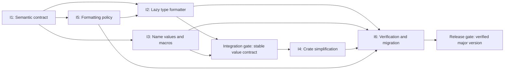

# M1 Plan: Lazy Semantic Names

Status: Draft for intention-by-intention discussion  
Target: Next major version  
Scope: Public naming semantics, lazy formatting values, macro composition, crate simplification, and release validation

## Milestone outcome

M1 pivots `pretty-name` toward lazy, allocation-free diagnostic names for Rust
language constructs:

- Type components come from the compiler-resolved description returned by
  `core::any::type_name`.
- Non-type identifiers are captured with `stringify!` after normal Rust code
  validates that the referenced item exists.
- Names are represented as borrowed values that implement `core::fmt::Display`.
- Formatting does not require a global cache, synchronization, or leaked
  allocations.
- Unsupported compiler descriptions remain informative and never become a
  runtime panic.

The milestone is divided into refactor intentions rather than a sequential task
list. Each intention owns a bounded set of decisions so it can be discussed and
revised separately. Implementation may proceed concurrently after the relevant
integration contracts are accepted.

## Working semantic baseline

The following decisions are the starting point for the six intentions. An
intention may refine a decision it owns, but cross-intention changes must update
the affected contracts explicitly.

1. A type alias is transparent to semantic type naming:
   `of_type!(Alias)` describes the aliased type rather than returning `"Alias"`.
2. Variables, functions, fields, methods, and variants have lexical identifiers
   because stable Rust does not expose their declared identifiers through
   semantic reflection.
3. Compound names intentionally combine both sources:
   `of_method!(Owner::method::<Arg>)` has semantic `Owner` and `Arg` components,
   but a lexical `method` component.
4. `core::any::type_name` is diagnostic input, not a persistent identifier or a
   stable serialization key.
5. The primary output contract is `Display`; allocation through `ToString` is an
   explicit caller choice.
6. Constant evaluation is not a milestone-wide guarantee. Lexical-only values
   may remain const-constructible when that falls out naturally from their
   representation.

## Parallel intention map

| Intention | Owns | May begin after | Primary integration output |
|---|---|---|---|
| [M1-I1](#m1-i1-semantic-contract-and-vocabulary) | Meaning and vocabulary | Immediately | Semantic contract |
| [M1-I2](#m1-i2-lazy-type-name-formatter) | Borrowed type formatting | I1 working baseline | `TypeName` behavior |
| [M1-I3](#m1-i3-composable-name-values-and-macros) | Macro validation and compound values | I1 working baseline | Macro/value contract |
| [M1-I4](#m1-i4-runtime-and-crate-simplification) | Cache, dependency, and platform removal | I2 and I3 prototypes | Simplified crate profile |
| [M1-I5](#m1-i5-formatting-policy) | Qualification and presentation options | I1 working baseline | Formatting policy contract |
| [M1-I6](#m1-i6-verification-migration-and-positioning) | Tests, benchmarks, migration, and release story | Immediately | Release gates |



The arrows describe integration dependencies, not a requirement to discuss or
prototype the intentions serially. In particular, I2 and I3 should agree on a
minimal boundary and then proceed independently; I6 can build its corpus and
migration inventory while production design is ongoing.

## M1-I1: Semantic contract and vocabulary

### Goal

Define one concise rule that predicts where every displayed component comes
from, independent of macro syntax shape.

### Owned decisions

- The distinction between a semantic type component and a lexical identifier
  component.
- Behavior for aliases, generic parameters, `Self`, imports, and re-exports.
- Whether function names remain lexical when their generic arguments are
  semantic.
- Terminology used throughout the API and documentation, especially avoiding
  language that implies runtime reflection.
- The guarantee level of compiler-generated type descriptions.

### Proposed contract

> Every type-bearing component is derived from the compiler's semantic type
> description. Every non-type identifier is captured lexically after compile-time
> validation.

Examples:

| Expression | Semantic components | Lexical components |
|---|---|---|
| `of_type!(T)` | `T` | None |
| `of_field!(T::field)` | `T` | `field` |
| `of_method!(T::method::<A>)` | `T`, `A` | `method` |
| `of_variant!(T::Variant)` | `T` | `Variant` |
| `of_function!(function::<A>)` | `A` | `function` |
| `of_var!(variable)` | None | `variable` |

### Edge cases to settle

- A type alias and a renamed type import should resolve to the underlying type
  description.
- A renamed function import should retain the identifier written at the macro
  call because the function component is lexical.
- A generic type parameter should display its concrete monomorphized type.
- `Self` should display the concrete implementing type.
- Two distinct types may shorten to the same output; this is a presentation
  collision rather than an identity collision.
- Compiler output may change between compiler releases without constituting a
  crate bug unless `pretty-name` corrupts or loses information unexpectedly.

### Non-goals

- Stable type identity, serialization keys, or protocol identifiers.
- Discovering declaration identifiers through compiler-private reflection.
- Making source spelling and semantic identity interchangeable.

### Acceptance criteria

- Every public function and macro can be classified using the contract without
  adding syntax-specific exceptions.
- Alias, generic-parameter, `Self`, import, and re-export examples are documented.
- The documentation distinguishes compiler resolution from runtime formatting.
- I2, I3, and I5 can reference this contract without redefining it.

### Open discussion questions

- Should the public vocabulary use `semantic` and `lexical`, or friendlier terms
  such as `resolved type` and `source identifier`?
- Should a fully lexical type-name operation remain in this crate under an
  explicitly source-oriented name, or be left to `nameof`?
- Should declaration-side or enclosing-function naming be part of a later
  milestone?

## M1-I2: Lazy type-name formatter

### Goal

Replace eager parsing, formatting, caching, and leaked strings with a borrowed
adapter that writes a shortened type description directly into a formatter.

### Owned decisions

- The public `TypeName` representation and constructors.
- The streaming transformation from an original type description to displayed
  output.
- `Display`, `Debug`, equality, and original-string access behavior.
- Behavior for unfamiliar or malformed diagnostic descriptions.
- Whether formatting options live directly in `TypeName` or in a separate
  adapter.

### Candidate public shape

The exact names are intentionally unresolved, but the value should support this
style of use:

```rust
let name = pretty_name::type_name::<Vec<crate::model::User>>();

tracing::debug!(ty = %name);
assert_eq!(name.to_string(), "Vec<User>");
assert_eq!(name.original(), core::any::type_name::<Vec<crate::model::User>>());
```

The value should borrow the original description, be inexpensive to construct,
and avoid owning a parsed syntax tree. `ToString` may allocate through the
standard `Display` blanket implementation when allocation is available.

### Formatter requirements

- Preserve references, mutability, raw-pointer qualifiers, function signatures,
  tuple arity, arrays, slices, trait bounds, associated-type bindings, and const
  arguments.
- Remove module qualification according to I5 without deleting surrounding
  punctuation or qualifiers.
- Handle paths after `>`, `)`, and `]` without damaging associated item syntax.
- Treat closure, async-block, and other compiler-generated descriptions as
  best-effort diagnostic text.
- Operate on valid UTF-8 boundaries and preserve raw identifiers.
- Propagate only errors reported by the destination `fmt::Write` implementation.

### Failure policy

Formatting must not panic because a compiler description uses an unfamiliar
shape. When a transformation cannot be applied confidently, the formatter must
preserve the affected input rather than return an opaque error marker or silently
drop it.

### Performance contract

- Construction performs no allocation and acquires no lock.
- `Display` performs one bounded-memory pass over the source description.
- Formatting writes directly to the destination without an intermediate
  `String`.
- Repeated formatting may repeat the scan; callers that need amortization can
  retain an explicitly allocated string.
- Performance claims require release-mode benchmarks from I6.

### Non-goals

- Parsing arbitrary Rust source into a complete syntax tree.
- Guaranteeing that the compiler description is valid Rust syntax.
- Interning or globally caching formatted strings.
- Reproducing every whitespace choice made by `rustfmt` or `prettyplease`.

### Acceptance criteria

- The complete type corpus in I6 formats without panic or information loss.
- Direct formatting performs no heap allocation.
- `TypeName` exposes the original compiler description.
- Unsupported descriptions have documented, deterministic fallback behavior.
- The formatter can be used with `core::fmt` in a `no_std` build.

### Open discussion questions

- Should `Debug` delegate to `Display`, or reveal the adapter and its original
  input conventionally?
- Should equality against `str` format lazily, or should callers compare an
  explicitly owned result?
- Should the adapter accept arbitrary borrowed strings through `From<&str>`?
- How small must the value remain before deriving `Copy` is justified?

## M1-I3: Composable name values and macros

### Goal

Make every macro construct a lazy display value from validated lexical parts and
semantic type parts, without allocating a final string.

### Owned decisions

- Public value types for identifiers, members, functions, and generic arguments.
- Macro return types and their common formatting behavior.
- Compile-time validation expressions.
- Composition punctuation and canonical display grammar.
- IDE completion behavior and qualified-path input syntax.

### Design principle

Validation and name production remain separate:

```text
real Rust expression or type use
    -> compiler validates the referenced construct

stringify!(identifier) and TypeName::of::<T>()
    -> produce lexical and semantic display components
```

This separation prevents `stringify!` from accepting misspelled identifiers and
prevents display implementation details from weakening compiler validation.

### Candidate value model

The intention should compare small category-specific values against one universal
name representation. A likely shape is:

- An identifier value containing one `&'static str`.
- A member value containing a semantic owner, a lexical member identifier, and
  zero or more semantic type arguments.
- A function value containing a lexical function identifier and zero or more
  semantic type arguments.
- A type macro returning the same `TypeName` value as the function API.

Const-generic arrays are a candidate for heterogeneous generic argument lists
because every argument can be erased to the same borrowed `TypeName` value. The
design must measure value size and monomorphization impact before adopting that
representation.

### Macro behavior matrix

| Macro | Validation requirement | Display composition |
|---|---|---|
| `of_var!` | Binding or constant resolves | Lexical identifier |
| `of_function!` | Function item and supplied arguments resolve | Lexical function plus semantic type arguments |
| `of_type!` | Type resolves, including `?Sized` forms | Semantic type |
| `of_field!` | Field access type-checks | Semantic owner plus lexical field |
| `of_method!` | Associated function or method item resolves | Semantic owner and arguments plus lexical method |
| `of_variant!` | Variant shape matches | Semantic owner plus lexical variant |

### Edge cases to settle

- Generic functions whose parameters cannot be inferred in the identifier-only
  form.
- The existing `::<..>` placeholder for validating a generic function while
  omitting its arguments.
- Generic and qualified owners requiring `<Type>::member` syntax.
- `Self` inside generic and non-generic implementations.
- Unit, tuple, and struct variants without weakening shape validation.
- Zero, one, and many generic arguments without trailing punctuation bugs.
- Whether the displayed owner uses `Owner::member`, `<Owner>::member`, or a
  policy selected by I5.

### Non-goals

- A procedural macro merely to normalize macro input syntax.
- Runtime lookup of identifier names.
- Forcing all categories into one public concrete type before a real shared use
  case requires it.
- Preserving the current `&'static str` return type.

### Acceptance criteria

- Every macro output implements `Display` without allocating.
- Every referenced item is still rejected at compile time when misspelled or of
  the wrong shape.
- Type aliases and generic parameters follow I1 consistently in every owner or
  argument position.
- Macro expansions contain no global cache or synchronization primitive.
- Existing IDE completion behavior is retained or any regression is explicitly
  documented and justified.

### Open discussion questions

- Is a common public trait useful beyond `Display`, or would it add abstraction
  without a concrete consumer?
- Should lexical-only macro values expose their identifier as `&'static str`?
- Should the function placeholder remain `::<..>` or be replaced in the major
  version?
- Should member values offer separate accessors for owner and leaf identifier?

## M1-I4: Runtime and crate simplification

### Goal

Remove infrastructure made unnecessary by lazy borrowed values and establish the
smallest justified platform and dependency footprint.

### Owned decisions

- Removal of process-wide and call-site caches.
- Removal of leaked allocations and synchronization.
- Dependency removal or retention.
- `no_std` and optional `alloc` configuration.
- Module boundaries for formatting and macro-support internals.
- Minimum supported Rust version policy for the major release.

### Expected removals

If I2 and I3 satisfy their contracts without eager parsing, this intention should
remove:

- `TYPE_NAME_CACHE` and its `RwLock<HashMap<...>>`.
- The `__with_cache!` macro and its per-call-site maps.
- `Box::leak` as a name-lifetime strategy.
- Runtime use of `syn`, `quote`, and `prettyplease`.
- Documentation describing cache hits as the normal performance model.

The preferred outcome is a dependency-free core using `core::any` and
`core::fmt`. An `alloc` feature may provide owned conveniences if they cannot be
expressed through the standard `ToString` implementation alone.

### Safety and failure handling

- No `unsafe` code is expected or justified by the current design.
- Lock poisoning and re-entrant initialization disappear with the caches.
- Allocation failure is limited to caller-requested ownership or the caller's
  formatting destination.
- Feature combinations must not silently change naming semantics.

### Performance considerations

- Removing caches trades repeated linear scans for the absence of lookup,
  locking, allocation, and permanent memory growth.
- Dependency and binary-size effects must be measured rather than inferred only
  from source size.
- Public value types should avoid unnecessary boxing and dynamic dispatch.
- Generic macro result types must be checked for code-size growth.

### Non-goals

- Adding a replacement cache before benchmarks demonstrate a real need.
- Keeping dependencies solely to minimize the textual size of the formatter.
- Feature flags that create several subtly different semantic contracts.

### Acceptance criteria

- No name operation relies on global mutable state or intentionally leaked
  memory.
- The core crate builds in its documented `no_std` configuration.
- Every remaining dependency has a documented necessity that cannot be met
  simply in the crate.
- The supported feature matrix is exercised by CI or equivalent release checks.
- I6 benchmarks show the cost profile of the simplified design.

### Open discussion questions

- Should `alloc` be enabled by default for `ToString` convenience?
- Is dependency-free operation a release requirement or a preferred outcome?
- What explicit MSRV promise should accompany the major version?
- Should experimental enclosing-function naming live behind a feature or outside
  M1 entirely?

## M1-I5: Formatting policy

### Goal

Define the default human-readable format and a restrained customization model
without recreating a complete Rust pretty-printer or `tynm`'s function-family
API.

### Owned decisions

- Default qualification depth.
- Optional retention of leading or trailing module segments.
- Generic-argument visibility.
- Lifetime presentation.
- Closure and compiler-generated suffix presentation.
- Canonical punctuation for owners, members, and generic arguments.

### Proposed defaults

- Remove all module qualification from type paths.
- Preserve all type and const arguments.
- Hide diagnostic placeholder lifetimes when doing so is unambiguous.
- Preserve mutability, pointer kind, ABI, unsafety, trait bounds, and associated
  bindings.
- Preserve unfamiliar compiler-generated text rather than guessing.
- Expose the original full compiler description separately.

### Candidate customization model

Prefer one small options value or builder-style adapter methods:

```rust
type_name::<T>()
    .qualified(1)
    .without_user_generics()
```

The example is illustrative, not an accepted API. Customization should remain
orthogonal: qualification controls paths, while generic visibility controls
arguments. Avoid a growing set of top-level functions for every combination.

### Collision policy

Short display names are not identities. When two paths shorten to the same text,
the default remains readable rather than globally unique. Callers needing local
disambiguation should be able to retain some qualification or use the original
description.

### Non-goals

- Stable canonical Rust syntax.
- User-defined renaming rules or registries in M1.
- Automatic uniqueness across crates or processes.
- Formatting arbitrary source tokens.

### Acceptance criteria

- Defaults are specified with examples covering every supported type category.
- Qualification and generic controls compose without special-case behavior.
- The public customization surface remains small enough to explain in one
  documentation section.
- I2 can implement the policy in one streaming pass with bounded memory.
- I3 has one canonical grammar for compound names.

### Open discussion questions

- Is suffix qualification alone sufficient, or is leading qualification useful?
- Should omission of non-standard-library generic arguments be supported?
- Should closures retain the enclosing function path by default?
- Should member owners always use `<Owner>::member` for syntactic uniformity, or
  prefer the less noisy `Owner::member` where possible?

## M1-I6: Verification, migration, and positioning

### Goal

Build the evidence needed to accept a breaking semantic and representation
change, and explain why the new crate deserves a distinct place in the ecosystem.

### Owned decisions

- Test corpus and test-layer responsibilities.
- Performance and binary-size benchmarks.
- Compatibility inventory and migration guidance.
- README narrative and comparison language.
- Release gates for the major version.

### Correctness strategy

Use complementary test layers:

- Unit tests for streaming formatter states and malformed-input fallback.
- Integration tests for public values and every macro category.
- Compile-fail documentation tests for invalid identifiers, fields, methods,
  variants, and types.
- Documentation tests for normal formatting and allocation-on-demand usage.
- A compiler-description corpus covering primitives, references, pointers,
  arrays, tuples, functions, traits, associated bindings, const generics,
  closures, async blocks, aliases, `Self`, and generic monomorphizations.

Tests should describe one observable behavior each. Small table-driven groups
are appropriate for formatter inputs, while macro validation cases should remain
individually named so failures identify the broken language construct.

### Performance strategy

Measure release builds for:

- Adapter construction without formatting.
- Formatting short and deeply nested types into an existing buffer.
- Formatting the same name repeatedly.
- Explicit conversion to `String`.
- Multi-threaded formatting without shared state.
- Binary size and dependency footprint for a minimal consumer.

Compare the vNext adapter with the current cached implementation, an eager
`String` formatter, and a representative lazy scanner such as `disqualified`.
Benchmarks must separate first-use cost from steady-state cost and must not claim
zero cost merely because work is deferred.

### Migration inventory

The major-version guide must cover:

- `&'static str` results becoming display values.
- Adding `.to_string()` only where owned text is required.
- Using `%name` or `{name}` for diagnostics and tracing.
- Type aliases and generic parameters changing from source spelling to resolved
  type descriptions.
- Const and static initializers that can no longer use semantic type names.
- Removal of cache-related behavior and pointer-identity assumptions.
- Any macro syntax changes accepted by I3.

### Positioning

The release narrative should emphasize the combined capability rather than
claiming to replace every neighboring crate:

> `pretty-name` composes compiler-resolved type descriptions with
> compile-time-validated Rust identifiers, then formats them lazily without
> allocation or global state.

The comparison should explain that:

- `nameof` is intentionally lexical and const-friendly.
- `disqualified` is a minimal lazy type-name shortener.
- `tynm` offers structured and configurable type-name parsing.
- `pretty-type-name` eagerly returns an owned shortened string.
- `pretty-name` covers compound language constructs whose type and identifier
  components require different sources.

### Acceptance criteria

- All behavioral changes have migration examples.
- Correctness and performance claims are backed by repeatable tests or
  benchmarks.
- `cargo test --locked` passes for the supported feature matrix.
- `cargo clippy --all-targets --all-features --locked -- -D warnings` introduces
  no warnings.
- README and rustdoc examples use the final value-oriented API.
- The release documentation states the diagnostic stability limits prominently.

### Open discussion questions

- Which benchmark results are important enough to publish in the README?
- Should compatibility helpers exist temporarily, or should the major version
  make a clean break?
- Should ecosystem comparisons be maintained as documentation or kept in the
  release announcement?
- Is M1 complete at API stabilization, or only after publishing the major
  release?

## Integration gates

### Gate A: Semantic contract accepted

Required intentions: I1, with the default portion of I5.

Exit conditions:

- Semantic and lexical components are defined for every macro.
- Default qualification and generic presentation are decided.
- Diagnostic stability limitations are accepted.

### Gate B: Stable value contract

Required intentions: I2 and I3.

Exit conditions:

- Core public value types and lifetimes are agreed.
- Compound values can format without allocation.
- Validation expressions remain compile-time checked.
- I4 can remove the old infrastructure without leaving compatibility shims in
  the hot path.

### Gate C: Simplified crate profile

Required intention: I4.

Exit conditions:

- Old caches, leaks, and unnecessary dependencies are gone.
- Platform and feature promises are verified.
- No unresolved runtime ownership mechanism remains.

### Gate D: Major-version release readiness

Required intention: I6, incorporating the accepted outputs of I1 through I5.

Exit conditions:

- Correctness corpus, compile-fail cases, and documentation tests pass.
- Performance and binary-size results are reviewed.
- Migration guide and public positioning are complete.

## Milestone risks

| Risk | Consequence | Mitigation owner |
|---|---|---|
| Compiler descriptions change | Output changes or new shapes appear | I1 documents limits; I2 preserves unknown input; I6 maintains corpus |
| Streaming formatter drops syntax | Misleading diagnostics | I2 uses lossless fallback; I6 tests adversarial forms |
| Lazy values become too large | Stack traffic and code-size growth | I3 compares representations; I6 benchmarks size and codegen |
| Short names collide | Ambiguous diagnostics | I5 supplies qualification controls and original access |
| Macro rewrite harms IDE support | Worse developer experience | I3 tests representative editor flows and preserves simple arms where useful |
| `no_std` work fragments behavior | Feature-dependent semantics | I4 keeps one semantic contract and tests the feature matrix |
| Major migration is cumbersome | Adoption stalls | I6 provides direct before/after recipes |

## M1 definition of done

M1 is complete when:

- All type-bearing components use the semantic compiler description.
- All non-type identifiers are compile-time validated and lexically captured.
- Public name values format lazily without an intermediate allocation.
- Formatting requires no global cache, synchronization, or leaked result.
- Unsupported compiler descriptions cannot cause a naming panic.
- Default formatting and customization behavior are documented and tested.
- The documented platform and feature matrix passes tests and clippy.
- Benchmarks characterize construction, formatting, ownership, concurrency, and
  binary-size costs.
- A migration guide explains every breaking semantic, type, and const-context
  change.
- The README presents the new diagnostic-name niche clearly and accurately.

## Intention discussion protocol

Use the stable intention ID when starting or revisiting a discussion, for
example: `Discuss M1-I3`. A revised intention should record any changed contract
and name every downstream intention that must be re-audited. Approval of one
intention does not imply approval of another, except through the explicit
integration gates above.
